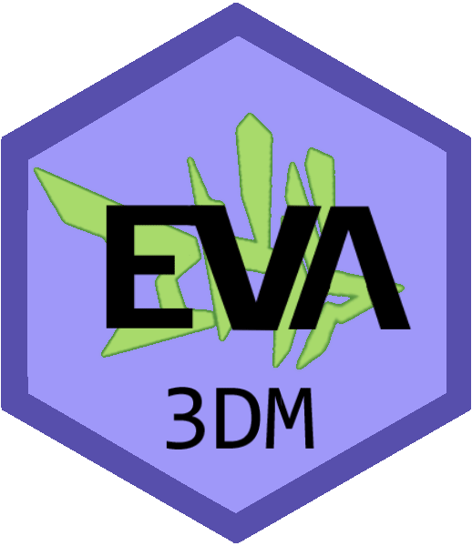

# eva3dm 

<!-- badges: start -->
 

 

 
<!-- badges: end -->

An R-package focusing on **EVA**luation of **3D** weather and air quality **M**odels.

The following workflow is recommended:

**1. Pre-processing of observations**: 

- Download of observations, METAR can be downloaded using the R-package [riem](https://docs.ropensci.org/riem/) or via the [Iowa State University](https://mesonet.agron.iastate.edu/request/download.phtml) site, Air Quality data for Brazil can be downloaded using the R-package [qualR](https://github.com/ropensci/qualR), or [QUALAR](https://qualar.cetesb.sp.gov.br/qualar) and [MonitorAir](https://www.data.rio/datasets/dados-hor%C3%A1rios-do-monitoramento-da-qualidade-do-ar-monitorar/explore) sites, and a range of satellite products are available at [NASA giovanni](https://giovanni.gsfc.nasa.gov/giovanni/) website.

- QA of the observation data.

- Process observation data for evaluation.

- Process of site-list if plan to extract time-series from the model.

**2. Pre-processing of model output**: Extraction and pre-processing of model outputs;

**3. Model Evaluation**: The functions `eva()` (to evaluate time-series) and `sat()` (to evaluate against satellite products) can be used to perform statistical (more details in `stat()`) and categorical (more details in `cate()`) evaluation;

**4. Visualization**: try some of the visualization functions from this package or other packages.

This package includes:

## Model Post-processing functions:

✔ `extract_serie()` extract and save time-series from WRF outputs and input files (and compatible NetCDF files);

✔ `extract_mean()` extract, average (or max, min, etc) and save variables in a NetCDF file;

✔ `extract_max_8h()` extract, calculate maximum (or avarage, max, min) 8h average and save variables in a NetCDF file;

✔ `wrf_rast()` extract variables and create `SpatRaster` or `SpatVector` from WRF files (and compatible NetCDF files) and the contrapart `rast_to_netcdf()` that converts `rast` to an array compatible to a NetCDF WRF file;

## Data pre-processing functions:

✔ `mda8()`, `ma8h()`, `hourly()`, and `daily()` process and calculate calculate time-series;

✔ `rh2q()`, `q2rh()`, that convert humidity units.

✔ `uv2ws()`, `uv2wd()`, that convert model wind components into wind speed and velocity.

✔ `rain()` to calculate hourly precipitation from model accumulated precipitation variables.

## Model evaluation functions:

✔ `eva()` data pairing and evaluation for time-series, `%IN%` allows fair evaluation;

✔ `sat()` evaluation for satellite image, `%IN%` can be used for fair evaluation;

✔ `stat()` calculate statistical metrics (integrated in `eva()` and `sat()`);

✔ `cate()` calculate categorical metrics (integrated in `eva()` and `sat()`);

✔ `write_stat()` and `read_stat()` to write and read evaluation results for `eva()` and `sat()`.

## Visualization and Utility functions:

✔ `ncdump()` print a `ncdump -h` equivalent command for a NetCDF file;

✔ `vars()` return the name of the variables on NetCDF file;

✔ `atr()` read and write attributes from a Netcdf file;

✔ `interp()` Interpolation (project and resample);

✔ `plot_rast()` custom plot for terra `SpatRaster` objects;

✔ `plot_diff()` custom plot for absolute or relative difference of terra `SpatRaster` objects;

✔ `overlay()` custom plot to overlay points or plot point-data,`%at%` can be used to georeference the evaluation results;

✔ `legend_range()` custom legend, display max, min and average;

✔ `template()` function that create post-processing and evaluation scripts;
