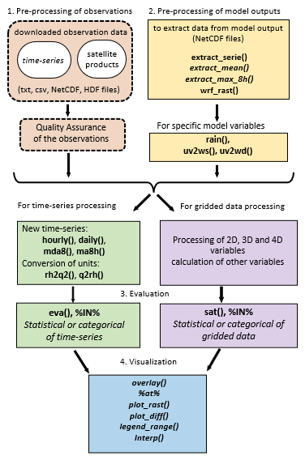

# Summary

Eva3dm is a package designed to support the evaluation of 3-dimensional physical models (particularly, weather and air quality models) against observation data in order to quantify different errors and bias present in the model results.

# Statement of need

Evaluation is a crucial step in any model application, as it ensures that the model results accurately represent the variables of interest. Without a good evaluation process, the reliability and applicability of model outputs remain uncertain. There are currently other tools available in R [@David:2012], Python [@Ladwig:2017] or other languages [@NCAR:2019;@Appel:2011]. However, these tools often focus on specific aspects (data visualization, geoprocessing, etc) and lack a fully integrated framework. This package fills that gap by streamlining the entire evaluation process—from preprocessing observations and model outputs to statistical analysis and visualization—offering a comprehensive and user-friendly solution for air quality model assessment.

# Description

The literature presents various evaluation criteria depending on the evaluated variable [@Emery:2001;@Ramboll:2018;@Monk:2019;@Zhang:2019;@Emery:2017;@Zhai:2024], which can be used to compare models and assess their performance. These criteria vary based on the simulation goal, observation variability, and measurement errors.

A brief description of the steps to perform a model evaluation and the functions to support these steps are described on the next sessions and Figure 1 shows a diagram of the workflow.

{ width=100% }

### 1. Pre-processing of observations

- Download of the observations, some examples include: 
  - METAR (METeorological Aerodrome Report) can be downloaded using the R-package [riem](https://docs.ropensci.org/riem/) or the [Iowa State University](https://mesonet.agron.iastate.edu/request/download.phtml) website
  - AERONET (Aerosol Robotic Network) can be downloaded at [AErosol RObotic NETwork](https://aeronet.gsfc.nasa.gov/new_web/data.html) website
  - Air Quality data for Brazil can be downloaded using the R-package [qualR](https://github.com/ropensci/qualR), or [QUALAR](https://qualar.cetesb.sp.gov.br/qualar) and [MonitorAir](https://www.data.rio/datasets/dados-hor%C3%A1rios-do-monitoramento-da-qualidade-do-ar-monitorar/explore) websites
  - Satellite products are available at [NASA giovanni](https://giovanni.gsfc.nasa.gov/giovanni/) website

- Process observation data for evaluation: Unit conversion, time zone conversion to UTC, and calculation of secondary variables. The functions `rh2q` and `q2rh` convert humidity units and the functions `mda8`, `ma8h`, `hourly`, and `daily` can be used to calculate average of time-series. The format used to evaluate time-series is a data.frame, the first column must contain time (in POSIXlt) and one additional column for each different location, satellite data can be read using the function `rast` from R-package terra.

- Quality Assurance of the observation data: check for values outside the valid range, check if the data is available for the time-period and region of the simulation and note any singular event.

### 2. Pre-processing of model outputs

Extraction of model outputs, unit conversion and calculation of secondary variable.

The function `extract_serie` extract and save time-series from model outputs using a data.frame with name of the location (row names), latitude (column lat) and longitude (column lon), while the functions `extract_mean` and `extract_max_8h` extract the average or the daily maximum of 8-hour moving average and save in a new NetCDF file.

The function `wrf_rast` can be used to read model output and return a `SpatRaster` or `SpatVector` object from the model files and its counterpart `rast_to_netcdf` that converts a `SpatRaster` to an array and/or save to a existing NetCDF file.

The functions `uv2ws` and `uv2wd` can be used to calculate wind speed and velocity from the model wind components (eastward and northward components) and the function `rain` can be used to calculate hourly precipitation from model accumulated precipitation variables.

### 3. Model evaluation functions:

The evaluation involves pairing observations with model results and calculating the statistical and/or categorical indexes.

There are two high level evaluation functions implemented in the package: `eva` and `sat`. The `eva` function performs the temporal pairing of both model and observation time-series by station (or combines all data). The `sat` function interpolates and pairs data on regular grids. Both functions call the low-level evaluation functions: `stat` to compute statistical metrics and `cate` to calculate categorical metrics based on a threshold value. These result can be written and read using the `write_stat` and `read_stat` functions.

### 4. Visualization and extractting information functions

Visualization of model results and statistical results. 

There are functions for visualization, interpolation and to extract information from NetCDF files, Table 1 show a relation of the visualization functions.

| Function name | Description |
| --- | --------- |
| `plot_rast` | Custom plot for `SpatRaster` objects  |
| `plot_diff` | Custom plot for absolute or relative difference of two `SpatRaster` objects     |
| `overlay`   | Custom plot to overlay points |
| `legend_range` | Custom legend that displays max, min and average |
| `interp` | Interpolation function that combines project and resample for `SpatRaster` objects |
| `ncdump` | Print a `ncdump -h` equivalent command for a NetCDF file |
| `vars` | Return the name of the variables on NetCDF file |
| `atr` | Read and write attributes from a Netcdf file |
Table: Visualization, interpolation and information functions.

Figure 2 shows examples of the first 4 functions on Table 1:

{ width=100% }

Bellow is presented a simple example of evaluation of temperature from WRF-Chem using METAR data.

``` r
library(eva3dm)

# folder with the data for this example
f          <- system.file("extdata",package="eva3dm")
# opening an example of observation from METAR, in degree Celsius
OBS        <- readRDS(paste0(f,"/metar.T2.Rds"))
# openeing data extracted from WRF-Chem model using extract_serie()
MODEL      <- readRDS(paste0(f,"/model.d03.T2.Rds"))
# converting from Kelving to Celcius
MODEL[-1]  <- MODEL[-1] - 273.15
# perform the model evaluation
evaluation <- eva(mo = MODEL, ob = OBS, rname = 'T2 from WRF-Chem')
print(evaluation)

```

### Special functions:

| Function name | Description | Objective |
| --- | --------- | --------- |
| `%at%` | Combine a data.frame containing evaluation results and a data.frame containing geographical coordinates (site list) | To georeference and the statistical results for visualization |
| `%IN%` | Filter a observation data.frame based on model time-series data.frame. Also can be used to crop a `SpatRaster` based on a second `SpatRaster` | To compare results from simulation with different domains |
| `template` | Create folders, post-processing and evaluation scripts | Templates to process and evaluate multiple variables from one or multiple simulations |
Table: Special functions.

Note that the examples from `eva3dm` are focused on the Weather Research and Forecasting coupled with Chemistry WRF-Chem [@Grell:2005], but the package can be applied to other models, such as CMAQ, CAMx, WACCM and CAM-Chem, more details can be found in the package documentation and vignettes.

# References
